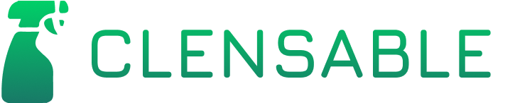

  

Clensable is a lightweight lead generation and outreach tool for local service businesses (like cleaning companies). It helps you discover local leads, generate AI-powered email/SMS campaigns, send outreach directly via Gmail/Outlook, and track responses—all in one dashboard.

💡 Features (MVP)
# Lead Discovery

* Search local businesses by city, zip code, or service type.

* Fetch 20–50 leads per campaign via Google Maps/Yelp API.

* Save and deduplicate leads in your dashboard.

# AI Outreach

* Generate AI-powered emails and SMS messages using GPT-4/5.

* Preview messages in multiple tones: friendly, professional, direct.

* Queue campaigns and send directly via Gmail/Outlook.

# Lead Export

* Export leads to CSV or Google Sheets.

* Track sent emails, opens, and replies directly in your dashboard.

# Dashboard

* Simple metrics: leads discovered, emails sent, open rates, reply rates.